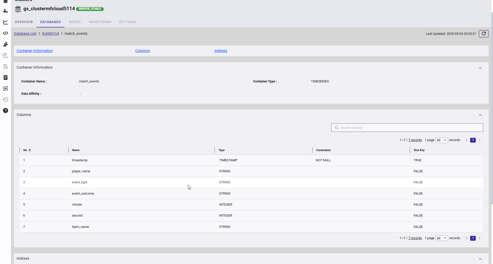

## **Introduction**

In modern sports, data-driven decision-making has become essential for gaining a competitive edge. Every step, shot, or lap generates a stream of events that require high-speed ingestion, efficient storage, and rapid querying—challenges that traditional relational databases struggle to handle at scale. To address this, organizations are increasingly looking into alternatives.

GridDB, a highly scalable and efficient time-series database, is designed to manage large volumes of continuously generated data such as above. By leveraging GridDB, teams can analyze critical performance metrics such as player speed, fatigue levels, and tactical positioning over time. These insights enable coaches and analysts to make informed decisions on game tactics, substitutions, and training regimens based on real-time and historical data.

In this article, we explore how GridDB, integrated within a Spring Boot application, can be used for a soccer analytics use case—optimizing player substitutions and refining game strategies with data-driven precision.

**Understanding the Use Case**

A single soccer match generates hundreds of timestamped events—such as a midfielder’s pass at given time e.g. 20:05:32 or a striker’s shot at time 20:10:15—each enriched with outcomes and metadata. The sequential nature of this data reveals crucial patterns, like player fatigue or shifts in attacking momentum, that static analyses often miss. For engineers, the challenge lies in efficiently managing this high-speed, high-volume data stream.

To simulate such kind of data, we will use the[ events/15946.json]([open-data/data/events/15946.json at master · statsbomb/open-data · GitHub](https://github.com/statsbomb/open-data/blob/master/data/events/15946.json)) dataset from [StatsBomb](https://statsbomb.com/what-we-do/hub/free-data/), which logs an entire match’s events—including passes, shots, and tackles—with millisecond precision. Our Spring Boot application, powered by GridDB, will focus on:

- **Performance Tracking**: Monitoring pass accuracy to detect signs of fatigue.
- **Strategy Optimization**: Analyzing shot frequency to uncover attacking opportunities.

## Setting Up GridDB Cluster and Spring Boot Integration

### **Project Structure**

Here's a suggested project structure for this application:

```shell
├───my-griddb-app
│   │   pom.xml
│   │   
│   ├───src
│   │   ├───main
│   │   │   ├───java
│   │   │   │   └───mycode
│   │   │   │       │   MySpringBootApplication.java
│   │   │   │       │   
│   │   │   │       ├───config
│   │   │   │       │       GridDBConfig.txt
│   │   │   │       │
│   │   │   │       ├───controller
│   │   │   │       │       MatchEventsController.java
│   │   │   │       │
│   │   │   │       └───service
│   │   │   │               MatchEventsService.java
│   │   │   │               MetricsCollectionService.java
│   │   │   │               RestTemplateConfig.java
│   │   │   │
│   │   │   └───resources
│   │   │       │   application.properties
│   │   │       │
│   │   │       └───templates
│   │   │               pass-accuracy-graph.html
```

This structure separates controllers, models, repositories, services, and the application entry point into distinct layers, enhancing modularity and maintainability. It can be further customized based on individual requirements.

### **Set Up GridDB Cloud**

For this exercise, we will be using GridDB Cloud vesion. Start by visiting the [GridDB Cloud](https://griddb.net/en/) portal and [signing up]([GridDB Cloud Free Plan | TOSHIBA DIGITAL SOLUTIONS CORPORATION](https://form.ict-toshiba.jp/download_form_griddb_cloud_freeplan_e?utm_source=griddbnet&utm_medium=topbanner)) for an account.


Based on requirements, either the free plan or a paid plan can be selected for broader access. After registration ,an email will be sent containing essential details, including the Web API URL and login credentials.

Once the login details are received, log in to the Management GUI to access the cloud instance.

#### Create Database Credentials

Before interacting with the database, we must create a database user:

- **Navigate to Security Settings**: In the Management GUI, go to the "GridDB Users" tab.

- **Create a Database User**: Click "Create Database User," enter a username and password, and save the credentials. For example, set the username as soccer_admin and a strong password.

- **Store Credentials Securely**: These will be used in your application to authenticate with GridDB Cloud.

#### Set Allowed IP Addresses

To restrict access to authorized sources, configure the allowed IP settings:

- **Navigate to Security Settings**: In the Management GUI, go to the "Network Access" tab and locate the "Allowed IP" section and add the .
- **Add IP Addresses**: For development, you can temporarily add your local machine’s IP.

#### 

### **Add POM Dependency**

Here's an example of how to configure the dependency in the`pom.xml` file:

```xml
<project xmlns="http://maven.apache.org/POM/4.0.0"
  xmlns:xsi="http://www.w3.org/2001/XMLSchema-instance"
  xsi:schemaLocation="http://maven.apache.org/POM/4.0.0 http://maven.apache.org/maven-v4_0_0.xsd">
  <modelVersion>4.0.0</modelVersion>
  <groupId>com.example</groupId>
  <artifactId>my-griddb-app</artifactId>
  <version>1.0-SNAPSHOT</version>
  <name>my-griddb-app</name>
  <url>http://maven.apache.org</url>

  <parent>
    <groupId>org.springframework.boot</groupId>
    <artifactId>spring-boot-starter-parent</artifactId>
    <version>3.2.4</version>
    <relativePath /> <!-- lookup parent from repository -->
  </parent>

  <properties>
    <maven.compiler.source>17</maven.compiler.source>
    <maven.compiler.target>17</maven.compiler.target>
  </properties>

  <dependencies>
    <dependency>
      <groupId>org.springframework.boot</groupId>
      <artifactId>spring-boot-starter-actuator</artifactId>
    </dependency>
    <dependency>
      <groupId>junit</groupId>
      <artifactId>junit</artifactId>
      <version>3.8.1</version>
      <scope>test</scope>
    </dependency>
    <dependency>
      <groupId>org.springframework.boot</groupId>
      <artifactId>spring-boot-starter-web</artifactId>
      <exclusions>
        <exclusion>
          <groupId>org.springframework.boot</groupId>
          <artifactId>spring-boot-starter-logging</artifactId>
        </exclusion>
      </exclusions>
    </dependency>
    <dependency>
      <groupId>org.springframework.boot</groupId>
      <artifactId>spring-boot-starter-test</artifactId>
      <scope>test</scope>
    </dependency>
    <dependency>
      <groupId>org.springframework.boot</groupId>
      <artifactId>spring-boot-starter-thymeleaf</artifactId>
    </dependency>
    <!-- JSON processing -->
    <dependency>
      <groupId>org.glassfish.jersey.core</groupId>
      <artifactId>jersey-client</artifactId>
      <version>2.35</version>
    </dependency>
    <dependency>
      <groupId>org.json</groupId>
      <artifactId>json</artifactId>
      <version>20210307</version>
    </dependency>
    <dependency>
      <groupId>com.fasterxml.jackson.core</groupId>
      <artifactId>jackson-databind</artifactId>
      <version>2.15.0</version> <!-- or the latest version -->
    </dependency>
    <!-- Lombok -->
    <dependency>
      <groupId>org.projectlombok</groupId>
      <artifactId>lombok</artifactId>
      <optional>true</optional>
    </dependency>
  </dependencies>
</project>
```

### **Technical Implementation**

Implementing a soccer analytics solution with GridDB and Spring Boot involves three key steps:

1. **Ingesting** the StatsBomb **events/15946.json** dataset into GridDB.
2. **Querying** the data to extract time-series metrics.
3. **Visualizing** the results to generate actionable insights.

Below, we explore each phase in detail, showcasing GridDB’s time-series capabilities and its seamless integration within a Spring Boot architecture.

#### **Step 1: Data Ingestion**

The **events/15946.json** file logs a sequence of match events—passes, shots, tackles—each record containing essential fields such as:

- **Timestamp** (e.g., `"2021-06-11T20:05:32.456"`)
- **Player Name** (`player.name`)
- **Event Type** (`type.name`)
- **Outcome** (e.g., `pass.outcome.name` as `"Complete"`, `shot.outcome.name` as `"Goal"`)

To efficiently store and query this data in **GridDB**, we first need define a **time-series container** in GridDb cloud as below.

##### **Container Setup**

We define a container name **match_events** in **GridDB Cloud** using the **time-series type** with `timestamp` as the **row key**.


Next, we will create schema which will includes the following columns:

- `timestamp` (**TIMESTAMP**, **NOT NULL**, **Row Key**)
- `player_name` (**STRING**)
- `event_type` (**STRING**)
- `event_outcome` (**STRING**)
- `minute` (**INTEGER**)
- `second` (**INTEGER**)
- `team_name` (**STRING**)



Afterwards we implement `MetricsCollectionService `which fetches data from JSON file and pushing the data in database.

Here the implentation of `MetricCollectionService.java` :

```java
package mycode.service;

import org.json.JSONArray;
import org.json.JSONObject;
import org.springframework.stereotype.Service;
import org.springframework.beans.factory.annotation.Value;
import java.io.OutputStream;
import java.net.HttpURLConnection;
import java.net.URL;
import java.time.LocalDate;
import java.time.format.DateTimeFormatter;
import java.util.Scanner;

@Service
public class MetricsCollectionService {
  private static String gridDBRestUrl;
  private static String gridDBApiKey;

  @Value("${griddb.rest.url}")
  public void setgridDBRestUrl(String in) {
    gridDBRestUrl = in;
  }

  @Value("${griddb.api.key}")
  public void setgridDBApiKey(String in) {
    gridDBApiKey = in;
  }

  public void collect() {
    try {
      // Fetch JSON Data from GitHub
      String jsonResponse = fetchJSONFromGitHub(
          "https://raw.githubusercontent.com/statsbomb/open-data/master/data/events/15946.json");
      JSONArray events = new JSONArray(jsonResponse);

      // Process and Send Data to GridDB Cloud
      sendBatchToGridDB(events);

    } catch (Exception e) {
      e.printStackTrace();
    }
  }

  private static String fetchJSONFromGitHub(String urlString) throws Exception {
    URL url = new URL(urlString);
    HttpURLConnection conn = (HttpURLConnection) url.openConnection();
    conn.setRequestMethod("GET");
    conn.setRequestProperty("Accept", "application/json");

    if (conn.getResponseCode() != 200) {
      throw new RuntimeException("Failed to fetch data: HTTP error code : " + conn.getResponseCode());
    }

    Scanner scanner = new Scanner(url.openStream());
    StringBuilder response = new StringBuilder();
    while (scanner.hasNext()) {
      response.append(scanner.nextLine());
    }
    scanner.close();
    return response.toString();
  }

  private static void sendBatchToGridDB(JSONArray events) {
    JSONArray batchData = new JSONArray();
    boolean startProcessing = false;
    for (int i = 0; i < events.length(); i++) {
      JSONObject event = events.getJSONObject(i);
      JSONArray row = new JSONArray();

      if (event.has("index") && event.getInt("index") == 10) {
        startProcessing = true;
      }

      if (!startProcessing) {
        continue; // Skip records until we reach index == 7
      }

      // Extract and format fields
      String formattedTimestamp = formatTimestamp(event.optString("timestamp", null));
      row.put(formattedTimestamp);
      row.put(event.optJSONObject("player") != null ? event.getJSONObject("player").optString("name", null) : null);
      row.put(event.optJSONObject("type") != null ? event.getJSONObject("type").optString("name", null) : null);

      JSONObject passOutcome = event.optJSONObject("pass");
      JSONObject shotOutcome = event.optJSONObject("shot");
      if (passOutcome == null && shotOutcome == null) {
        continue;
      }

      if (passOutcome != null) {
        if (passOutcome.has("outcome")) {
          row.put(passOutcome.getJSONObject("outcome").optString("name", null));
        } else {
          row.put(JSONObject.NULL);
        }
      } else if (shotOutcome != null) {
        if (shotOutcome.has("outcome")) {
          row.put(shotOutcome.getJSONObject("outcome").optString("name", null));
        } else {
          row.put(JSONObject.NULL);
        }
      } else {
        row.put(JSONObject.NULL);
      }

      row.put(event.optInt("minute", -1));
      row.put(event.optInt("second", -1));
      row.put(event.optJSONObject("team") != null ? event.getJSONObject("team").optString("name", null) : null);

      batchData.put(row);
    }

    sendPutRequest(batchData);
  }

  private static String formatTimestamp(String inputTimestamp) {
    try {
      String todayDate = LocalDate.now().format(DateTimeFormatter.ISO_DATE);
      return todayDate + "T" + inputTimestamp + "Z";
    } catch (Exception e) {
      return "null"; // Default if parsing fails
    }
  }

  private static void sendPutRequest(JSONArray batchData) {
    try {
      URL url = new URL(gridDBRestUrl);
      HttpURLConnection conn = (HttpURLConnection) url.openConnection();
      conn.setDoOutput(true);
      conn.setRequestMethod("PUT");
      conn.setRequestProperty("Content-Type", "application/json");
      conn.setRequestProperty("Authorization", gridDBApiKey);
      // Encode username and password for Basic Auth

      // Send JSON Data
      OutputStream os = conn.getOutputStream();
      os.write(batchData.toString().getBytes());
      os.flush();

      int responseCode = conn.getResponseCode();
      if (responseCode == HttpURLConnection.HTTP_OK || responseCode == HttpURLConnection.HTTP_CREATED) {
        System.out.println("Batch inserted successfully.");
      } else {
        System.out.println("Failed to insert batch. Response: " + responseCode);
      }

      conn.disconnect();
    } catch (Exception e) {
      e.printStackTrace();
    }
  }

}
```

#### Ingestion Logic

This steps involves fetching data from GridDB using the REST API and grouping it into 5-minute intervals.

```java
package mycode.service;

import com.fasterxml.jackson.databind.JsonNode;
import com.fasterxml.jackson.databind.ObjectMapper;

import org.springframework.stereotype.Service;
import java.net.URI;
import java.net.http.HttpClient;
import java.net.http.HttpRequest;
import java.net.http.HttpResponse;
import java.util.HashMap;
import java.util.Map;

@Service
public class MatchEventsService {

  private static final String GRIDDB_URL = "https://cloud5114.griddb.com:443/griddb/v2/gs_clustermfcloud5114/dbs/9UkMCtv4/containers/match_events/rows";
  private static final String AUTH_HEADER = "Basic TTAyY...lhbEAx";

  private final HttpClient httpClient = HttpClient.newHttpClient();
  private final ObjectMapper objectMapper = new ObjectMapper();

  public Map<Integer, Integer> getPassCountByFiveMin(String playerName) {
    try {
      // Build the HTTP request based on your curl
      HttpRequest request = HttpRequest.newBuilder()
          .uri(URI.create(GRIDDB_URL))
          .header("Content-Type", "application/json")
          .header("Authorization", AUTH_HEADER)
          .POST(HttpRequest.BodyPublishers.ofString("{\"offset\": 0, \"limit\": 55555}"))
          .build();

      // Fetch the response
      HttpResponse<String> response = httpClient.send(request, HttpResponse.BodyHandlers.ofString());
      JsonNode rootNode = objectMapper.readTree(response.body());
      JsonNode rows = rootNode.get("rows");

      // Process data: count passes every 5 minutes
      Map<Integer, Integer> passCountByFiveMin = new HashMap<>();

      for (JsonNode row : rows) {
        String currentPlayer = row.get(1).asText();
        String eventType = row.get(2).asText();
        int minute = row.get(4).asInt();

        if (playerName.equals(currentPlayer) && "Pass".equals(eventType)) {
          // Group by 5-minute intervals (0-4, 5-9, 10-14, etc.)
          int fiveMinInterval = (minute / 5) * 5;
          passCountByFiveMin.merge(fiveMinInterval, 1, Integer::sum);
        }
      }

      return passCountByFiveMin;

    } catch (Exception e) {
      e.printStackTrace();
      return new HashMap<>();
    }
  }
}
```

###### Step 3: Visualization

To deliver insights, Spring Boot exposes REST endpoints via a @RestController:

- **Endpoints**: /api/pass-accuracy/{player} returns a JSON array of {time, accuracy} pairs; /api/shot-frequency/{team} returns {time, shots}.

- **Implementation**: The controller calls the query service, maps GridDB results to DTOs, and serializes them with Spring’s Jackson integration.

```java
package mycode.controller;


import mycode.service.MatchEventsService;

import org.springframework.beans.factory.annotation.Autowired;
import org.springframework.stereotype.Controller;
import org.springframework.ui.Model;
import org.springframework.web.bind.annotation.*;

import java.util.Map;

@Controller
public class MatchEventsController {

  @Autowired
  private MatchEventsService matchEventsService;

  @GetMapping("/pass-accuracy/{playerName}")
  public String getPassCountEveryFiveMin(@PathVariable String playerName, Model model) {
    Map<Integer, Integer> passCountByFiveMin = matchEventsService.getPassCountByFiveMin(playerName);

    // Prepare data for the chart
    model.addAttribute("playerName", playerName);
    model.addAttribute("timeIntervals", passCountByFiveMin.keySet().stream().sorted().toList());
    model.addAttribute("passCounts", passCountByFiveMin.values());

    return "pass-accuracy-graph"; // Thymeleaf template name
  }
}
```

###### 

### Running the Project

To run the project, execute the following command to build and run our application:

```shell
mvn clean install && mvn spring-boot:run  
```

### Accessing the Dashboard

After launching the application, open a web browser and navigate to: `http://localhost:9090/pass-accuracy/{{player name}}`.

For example,

http://localhost:9090/pass-accuracy/Lionel%20Andr%C3%A9s%20Messi%20Cuccittini 

This visualization displays a chart representing pass accuracy trends over time. 


It provides insights into the player's fatigue levels over time and their overall activity on the field.


Similarly various insights can be generated from this saved data, providing valuable analytics for team performance and decision-making. For example,

- **Player Pass Accuracy Over Time**
  
  - **Data**: Count of "Pass" events with outcome.name = "Complete" vs. "Incomplete" per player, bucketed by 5-minute intervals.
  
  - **Visualization**: Line graph with time (x-axis) and pass accuracy percentage (y-axis) for a key player (e.g., a midfielder).
  
  - **Insight**: If pass accuracy drops below 70% late in the game (e.g., after minute 70), the player may be fatigued—time for a substitution.

- **Graph: Goal Proximity Over Time**
  
  - **Data**: Count of "Shot" events with shot.outcome.name = "Goal" or near-miss outcomes (e.g., "Off Target"), bucketed by 10-minute intervals.
  
  - **Visualization**: Stacked bar graph with time (x-axis) and shot outcomes (y-axis).
  
  - **Insight**: Periods with frequent near-misses (e.g., minute 30-40) suggest missed opportunities—adjust tactics to capitalize on pressure.

### **Conclusion:**

As demonstrated, GridDB efficiently processes the timestamped complexity of soccer events, delivering structured insights with precision. Integrated within a Spring Boot application, its high-performance ingestion, optimized time-series indexing, and rapid querying capabilities enable the extraction of actionable metrics from StatsBomb data—identifying player fatigue and strategic opportunities with millisecond accuracy. 

As sports technology continues to evolve, such implementations highlight the critical role of specialized databases in unlocking the full potential of temporal data.